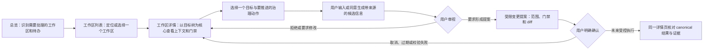

# R-001 · 单用户工作流、三页信息架构与最小垂直旅程（收集稿）

> **审视状态**：D-006 收敛首切片；D-010/A-017 关闭 **F-001**；D-012/A-019 按 α 关闭 **F-005** 并立项 GOAL-012。本稿不代表 `web/` 已实现；生产写入仍受 F-007/F-008 门禁。

## 1. 目标与已知边界

本稿让一名用户在不直接阅读全部 Markdown 的前提下，定位工作区与目标、理解当前治理上下文、审视 AI 或用户提供的候选信息，并在未来通过受控路径完成一次窄的 canonical 变更。

已知约束：

- 只有一名用户；不引入账号、协作者、角色、权限模型或“审计者”身份。审计、确认和负责人只是这名用户在工作流中的视角。
- 当前工作区 canonical root 与其 `goal-tree.md` 始终是 canonical 真相源。总览中的摘要、待办数和最近活动都是导航或计算视图，不能变成第二套状态。
- AI 只能提出候选；未经用户显式确认的内容不能显示为 canonical 事实、证据、执行事实或 finding 关闭依据。外部工具调用仍须由用户请求或同意。
- 工作区之间不能混合目标上下文、候选或写入。共享资料区是第一期必备能力：用户上传并全权 CRUD，AI 助手可在既定 AI 边界内自行读取；每个工作区只可见自身和共享资料区。用户已接受版本化哈希固定引用、本地注释/派生指向固定原资料版本、删除前影响警示与可追溯历史、以及敏感/不可信/版权约束资料不执行指令且不自动外传的规则；其存储、访问/操作和验证契约仍由 I-010 收集。
- 当前 `web/` 只有单实例目标概览与单目标详情的只读路由。本稿描述的是产品发现输入，不是现有 UI 的功能清单。

尚未决定的内容包括多工作区的 canonical 根目标映射（I-009）、事实/候选数据契约（I-008）、AI 提供方与工具同意（I-002）、确认和受控写入协议（I-003/I-004/I-006）。下文不得被解读为这些问题已经解决。

## 2. 用户接受的首个垂直切片

本切片从一个已经明确选定的工作区详情页开始，不以前台总览或工作区列表作为入口。用户在目标树中选择既有目标，提交一条用户提供的候选执行事实，审视后形成一项只追加到该目标 `02-execution.md` 的受限提案。用户确认后才可能执行，并在同一详情页核对结果与证据。

它明确不包含：跨工作区摘要、列表、创建或归档；共享资料区查看/管理或 CRUD；AI、网络或本地工具调用；任意文档编辑；创建目标、关闭 finding 或改变目标状态。D-004 的共享资料区方向和三页信息架构仍是后续范围，不因本切片被移除或视为已实现。

在实现前，以下四类对象必须在 I-003/I-004/I-006 下形成可审查契约：

| 对象 | 首个必要边界 | 仍待定义 |
|------|--------------|----------|
| `Candidate` | 用户提供；绑定工作区、目标、来源说明和未确认状态。 | 字段、编辑/拒绝/撤回状态和持久化边界。 |
| `Proposal` | 只指向一个 `02-execution.md` 追加；包含目标文件、canonical 基线、diff、门禁快照和有效期。 | 提案生成、校验和过期规则。 |
| `Confirmation` | 只确认不可变的提案摘要，不以“看过页面”代替确认。 | 确认状态机、撤回和本地信任边界。 |
| `ExecutionReceipt` | 关联 operation id、实际写入、审计证据及失败/恢复结果。 | 幂等、并发、恢复和可核对呈现。 |

这些对象是待定义的设计名词，绝不表示当前仓库已拥有应用状态、API 或写入能力。

### 2.1 D-007 对象映射与实现优先级

本稿第 2 节保留 D-006 收敛时使用的 Candidate 与 Confirmation 名称，便于追溯历史。后续规格、fixture、API/服务边界和 UX 文案必须以 R-004 第 6.1 节的用户接受线性流为准：

| 本稿历史名称 | D-007 / R-004 第 6.1 节的优先名称 | 约束 |
|--------------|------------------------------------|------|
| Candidate | CandidateRevision | 可编辑草稿；提交后固定 content digest，旧修订不能继续形成提案。 |
| Proposal | Proposal | 绑定不可变候选修订与 proposal digest。 |
| Confirmation | UserDecision | 只对一个 proposal digest 作 affirm、reject 或 cancel；affirm 在同一受控请求中触发重校验和执行。 |
| ExecutionReceipt | ExecutionReceipt | 只记录一次执行终态，不扩展为重叠的权威状态机。 |

本映射只同步已接受的 D-007 设计约束；它不定义实现接口、不把四类对象标为现有应用状态，也不关闭 I-003/I-004/I-006 或 F-007/F-008。

## 3. 后续信息架构的单用户核心工作流

| 步骤 | 用户任务 | 工作台必须呈现 | 不得发生的事 |
|------|----------|----------------|----------------|
| 1. 定位 | 从总览发现待确认项、开放门禁或最近活动。 | 摘要的来源范围、工作区名称/根目标，以及进入列表或详情的导航。 | 将聚合摘要当作可写目标状态，或因摘要存在而隐藏资料不完整。 |
| 2. 选择 | 在工作区列表中定位一个工作区并进入。 | 该工作区的根目标、状态摘要、待确认/门禁数量和最近活动；打开后清楚显示工作区上下文。 | 带入另一个工作区的目标、候选、资料或 AI 上下文。 |
| 3. 理解 | 在工作区详情的目标树中选定一个目标，查看门禁、最近事实和关联证据。 | 目标树为主要导航；所选目标、canonical 与计算视图区分、开放 finding 与信息门禁。 | 把未确认候选或 AI 推导显示成 canonical 事实，或由 AI 自动放行。 |
| 4. 形成候选 | 用户输入一项资料/事实，或显式请求 AI 基于已允许来源提出候选。 | 候选的来源、时间、引用或推导链、适用工作区/目标、当前为“未确认”的状态，以及编辑/拒绝/形成提案入口。 | 在没有用户触发或同意时后台检索；缺少来源的内容伪装成事实。 |
| 5. 审视 | 用户编辑、拒绝或要求将候选转为受限变更提案。 | 将候选和 canonical 基线清楚对照；拒绝不改变长期记录。 | 以“看过卡片”替代明确确认，或把拒绝记录成事实。 |
| 6. 确认与核对 | 用户查看受影响记录和 diff，未来在明确确认后核对结果与证据。 | 受影响工作区/目标、门禁检查、提案 diff、确认或取消入口，以及执行后的 canonical 结果和证据链接。 | 本稿据此宣称确认状态机、写入事务、operation id、并发/幂等或恢复语义已设计完成。 |

### 单用户成功信号（待审视，不是验收结果）

1. 用户无需猜测当前工作区或目标，即可从总览和列表进入正确的目标树上下文。
2. 用户能看出某项内容是 canonical、计算视图还是未确认候选，并能不产生写入地拒绝候选。
3. 对一个既有目标，用户能在同一详情页看清一次受限提案的影响、确认入口和结果证据。
4. 用户不能通过任一页面跨工作区混用上下文，也不能让 AI 自动做 P-004 裁决、关闭 required finding 或写入事实。

## 4. 后续三页信息架构候选

总览、工作区列表和工作区详情仍是后续产品信息架构的候选。首个切片只实现工作区详情；在 I-009 决定前，前两者不得被实现为跨工作区导航。工作区详情中的“事实确认”“共享资料区查看/管理”“门禁”“审计”和“受控变更”在后续可作为同页上下文面板或动作入口，避免无证据地扩展为更多顶层页面。

| 顶层页面 | 要回答的问题 | 主要内容与入口 | 明确边界 | 状态、空态与失败态 |
|----------|--------------|----------------|----------|--------------------|
| **总览** | 现在有什么需要我处理？ | **后续候选，待 I-009/I-011 审视**：若允许平台级导航例外，可显示工作区最小导航元数据；字段范围尚未确认。不得据此显示其他工作区的目标、资料、候选、AI 上下文或可写状态。 | 不属于首个切片。只做被确认允许的跨工作区导航与提示；不编辑目标、候选或资料，也不保存第二套状态。若不允许导航例外，则不得呈现其他工作区信息。 | **正常**：仅显示经确认允许且来自可读取范围的元数据。**空态**：尚无可见工作区。**降级**：来源不完整时明确列出不能确认的摘要。**失败**：索引来源不可读，停止把陈旧数据当作当前事实。 |
| **工作区列表** | 我要进入哪个工作区？ | **后续候选，待 I-009/I-011 审视**：若允许平台级导航例外，按工作区展示已确认允许的最小导航字段；具体字段和搜索/筛选行为尚未确认。未来的创建或归档从此发起受控提案，但不是直接操作。 | 不属于首个切片。平台索引只用于导航；不得用列表缓存维护独立目标生命周期，且不得暴露其他工作区的目标、资料、候选或 AI 上下文。若不允许导航例外，则不得列出其他工作区。 | **正常**：每行只含经确认允许的导航元数据。**空态**：没有可见工作区。**无结果**：筛选没有匹配项且不等同于没有工作区。**冲突/失败**：根目标映射重复、索引过期或来源不可读时禁止进入不确定的写入流程，并提示用户回到 canonical 诊断。 |
| **工作区详情（目标树核心）** | 在这个工作区里，我该理解、审视或确认什么？ | 首个切片的唯一主界面：持久显示工作区与根目标；目标树为中心导航；所选目标的 canonical 事实、用户提供的候选、门禁与受限提案区。共享资料区查看/管理和 AI 入口不在此切片实现。 | 同页区域不能被实现为绕过确认的独立写入入口；候选不得混入 canonical 区；共享资料区具体 UI/API 契约不在本稿冻结。 | **正常**：目标树、选中目标和可追溯上下文可读。**空态**：新工作区尚无目标树。**待确认**：候选以明确标签隔离。**阻断**：required 信息门禁或 finding 开放时显示影响范围。**失败**：canonical 基线变化或提案过期时停止确认并回到可核对状态。 |

### 导航与上下文规则

1. 总览和工作区列表只携带“选择哪个工作区”的导航意图；进入详情后必须重新建立该工作区的 canonical 上下文，不能复用前一个工作区的候选或草稿。
2. 工作区详情内部的树节点、事实候选、资料引用、门禁、审计和提案保持同一工作区与目标上下文。切换工作区时，未确认候选必须明确保留为未提交草稿或被放弃，不能自动迁移。
3. 从详情返回列表或总览时，只汇总允许展示的导航摘要；“待确认”“开放门禁”等数量应可追溯，且不能代替详情中的原始 canonical 证据。
4. 所有可能改变长期记录的动作从详情中的受控提案入口开始，完成、取消、拒绝或失败后都回到同一详情页显示可核对结果。

## 5. 已接受范围内的最小垂直旅程

### 场景：为显式选定的既有工作区中的既有目标审视一项用户提供的候选执行事实

该旅程故意只覆盖一个已存在的工作区和一个已存在的目标。共享资料区仍是第一期必备能力，但不在此切片展示查看/管理入口或 CRUD。它不以创建工作区、选择 AI 提供方、调用工具或开放任意文档写入作为前置条件。

| 阶段 | 用户动作 | 预期界面与证据 | 仍未被本稿解决的门禁 |
|------|----------|----------------|------------------------|
| A. 进入 | 直接打开一个显式选定的既有工作区详情。 | 详情页显示工作区根目标、目标树与当前门禁；不携带其他工作区上下文。 | I-009 的长期根目标映射、平台索引与隔离测试仍未完成。 |
| B. 定位 | 在目标树中选择一个既有目标，阅读其最近 canonical 事实和开放门禁。 | 所选目标与来源文档可追溯；未确认内容没有出现在 canonical 区。 | I-008 的事实/候选数据与交互契约。 |
| C. 形成候选 | 用户提供“建议记录一条执行事实”的候选。 | 候选显示用户提供来源说明、适用工作区与目标、未确认状态；用户可编辑或拒绝。 | I-008 的来源/撤回细节，以及四类对象的字段与状态机。AI 工具不在本切片调用。 |
| D. 形成受限提案 | 用户要求把已编辑候选转成“向该目标的 `02-execution.md` 追加一条用户确认的执行事实”的提案。 | 详情页显示只涉及一个目标记录的提案范围、受影响文件、diff、当前门禁与取消入口。 | I-003/I-004/I-006 的确认绑定、写入事务、fail-closed、并发与恢复。 |
| E. 明确确认与结果 | 在未来受控实现中，用户确认完全匹配的提案；系统显示最终 canonical 结果及关联证据。 | 用户能在同一详情页核对实际写入内容、更新时间和证据链接；拒绝、过期、基线变化或校验失败均不写入。 | 需要 R-004 设计和后续实现/负向测试，当前没有运行时证据。 |

### 此旅程的范围控制

- 只选择一次对既有目标的受限执行事实追加，避免同时实现目标新建、审计关闭、工作区创建或任意 Markdown 编辑。共享资料区仍属于第一期必备范围，但其模型、管理操作与验证由 I-010/R-003 单独收集，不能被本窄旅程的存在替代。
- 首个切片只接受用户输入的候选，不接入 AI、网络工具、资料库或本地自动化。它们属于 I-002/I-008 的后续设计范围。
- 用户拒绝、取消、提案过期、基线变化、门禁阻断和来源缺失都是首要路径；它们必须保持“不写入”而非静默降级。
- 该场景为后续实现目标提供范围候选，不授权在本 GOAL-009 中改动 HTTP 路由、开放 Web 写入或将任何 finding 标记为已关闭。

## 6. 非目标与仍待审视的问题

### 明确非目标

- 多用户协作、账号、角色/权限、通知分派或“审计者”身份。
- AI 自行检索后自动把内容写为事实，或自行裁决 P-004、关闭 finding、标记目标 `done`。
- 在三个顶层页面之外为每一种治理动作创建独立应用页面。
- 将工作区列表、活动流或候选缓存变成 canonical 状态数据库。
- 把现有只读路由、仓储层 recovery 或本稿当作受控写入已完成的证据。

### 需要用户审视的具体问题

1. `Candidate`、`Proposal`、`Confirmation`、`ExecutionReceipt` 分别需要哪些字段、状态迁移、保留期限和失败呈现，才能满足 I-003/I-004/I-006？
2. 首个受限提案如何绑定 canonical 基线、diff、门禁快照、有效期与 operation id，且在过期、重放、并发和恢复时 fail closed？
3. 上述正常、空态、阻断和失败态是否覆盖用户最关心的“不能确认或不能继续”情形？
4. 在“工作区彼此不可见、各自只可见自身和共享资料区”的确认下，平台级总览/工作区列表是否允许显示跨工作区的最小导航元数据？若允许，哪些字段可见，且如何保证不暴露其他工作区的目标、资料、候选或 AI 上下文？

用户已对首个垂直切片范围作出 D-006 裁决；其余问题仍应回写 I-001/I-011、I-003/I-004/I-006 与 I-009 的证据栏。

## 7. I-001 / I-011 可核对审视结论（2026-07-21 · 瞄准 F-001 / F-005）

本结论由 `/govern` 根据 D-002、D-006、本稿 §2–§6 与 A-001 关闭要求逐项核对；**不**冒充 independent 审计。证据路径均可打开复核。

### 7.1 对照 F-001（单用户无角色边界）

| 关闭要求（A-001） | 证据 | 判断 |
|------------------|------|------|
| 工作流改为单一用户可切换的治理视角 | D-002 §1；本稿 §1、§3 工作流表（定位/选择/理解/候选/审视/确认均为同一用户视角） | **满足** |
| 写清不做的多用户/多角色能力 | D-002 §1；本稿 §6 非目标（无账号/协作/角色/“审计者”身份） | **满足** |
| 以页面场景审视该边界 | 本稿 §4 三页场景边界 + §5 首切片旅程；均无角色入口 | **满足** |

**结论 · F-001**：**关闭**。单用户无角色已成为可追溯产品边界，并有页面场景支撑；不再以原“负责人/协作者/审计者”角色模型为方案基线。

**不扩大解释**：关闭 F-001 ≠ 路线图 A 全部退出 ≠ I-001 整项 `verified`（长期成功标准与可用性试点证据仍可继续收集）。

### 7.2 对照 F-005（三页 IA + 端到端旅程 · 立项前）

| 关闭要求（A-001） | 证据 | 判断 |
|------------------|------|------|
| 审视页面信息架构 | 本稿 §4 总览/列表/详情候选；D-006 将总览/列表剔除出首切片 | **部分**：详情已收敛；总览/列表依赖 I-009 导航例外未决 |
| 状态 / 空态 / 失败态 | 本稿 §4 各页状态列；§5 失败路径原则 | **部分**：详情与首切片路径充分；跨工作区页未冻结 |
| 一个端到端用户旅程 | D-006 + 本稿 §5（用户提供执行事实 → 受限提案 → 未来确认/核对） | **满足（首切片范围）** |
| 目标树为工作区详情核心 | D-006 §2；本稿 §2、§4 详情行 | **满足** |

**结论 · F-005（历史审视）**：曾保持 open；**已由 D-012 / A-019 按路径 α 关闭**（2026-07-21）。

关闭后范围：首实现 = 配置选中的**产品工作区**详情 + §5 旅程；总览/列表/N1 产品化与资料 CRUD 后置；GOAL-012 已立项。完整三页 IA 仍可继续收集，不再阻断 α 实现。

### 7.3 I-001 / I-011 信息项状态

| 信息项 | 审视结论 | 状态（仍） | 说明 |
|--------|----------|------------|------|
| I-001 | 单用户核心工作流、非目标、首试点场景已可核对 | `required / collecting` | F-001 相关子集已满足；完整产品成功标准与试点可用性仍可收集，不标 `verified` |
| I-011 | 详情主界面 + 首切片旅程 + 状态骨架已可核对；三页完整 IA 未冻结 | `required / collecting` | 阻断 F-005 关闭与实现立项；不标 `verified` |

### 7.4 硬禁令（重申）

- **F-005 关闭前**：不创建实现子目标。  
- **F-007/F-008 关闭且 I-003/I-004/I-006 `verified` 前**：不开放 Web/AI 写入。

## 8. 产品工作区 vs 本仓 dogfood（D-011）

本稿旅程中的「工作区」均指 **产品运行时工作区**（消费方/部署配置选中的 canonical 根），**不是**本开源仓 `workspace-001-goal-governance` 的过程记录自动外泄。

| 澄清 | 对 R-001 的含义 |
|------|-----------------|
| Web/Skills 可独立服务于其他项目 | 总览/列表（若实现）只列**实例配置内**工作区 |
| 方法论/模板随包副本 | 不替代、不包含过程性 goal-tree |
| 本仓过程树与共享资料不复制、他项目不知悉 | 首切片「显式选定既有工作区」= 配置选中的**产品**工作区；开发 dogfood 须显式开关 |
| F-005 路径 α（D-011 设计默认） | 首实现 = 单产品工作区详情 + 受限执行事实追加；三页完整 IA 可后置 |

D-012 / A-019 已按 α **关闭 F-005** 并创建 GOAL-012。实现与生产写入门禁见 GOAL-012 与 F-007/F-008。
